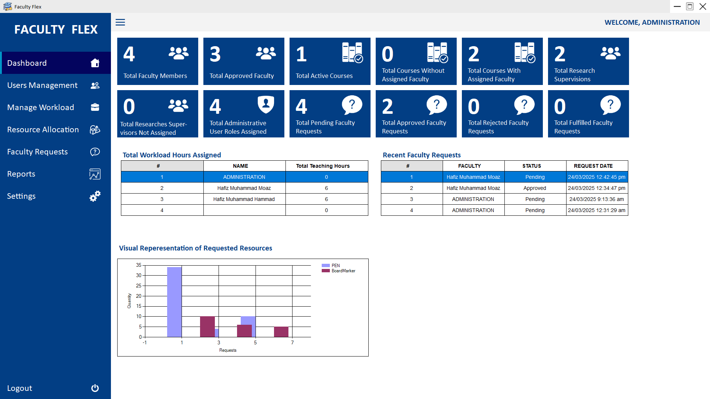

# FacultyFlex - Faculty Management Software

FacultyFlex is a Windows Forms Application built using **C# and MySQL** to streamline **faculty workload management** and **resource allocation** at the **Department of Computer Science, UET Lahore**. The system replaces inefficient manual processes with a **centralized, role-based platform**, ensuring better workload distribution, faculty request tracking, and improved department planning.

---

## 📌 Features

### 🔐 User Authentication & Role Management
- Secure **login system** with **hashed passwords**.
- **Secure **login system** with **hashed passwords**.
- **Forgot password & account recovery system**.

### 🏫 Faculty Management
- **Add, update, delete faculty profiles**.
- Store faculty details (**Name, Designation, Research Interests, Teaching Hours**).
- Assign faculty roles from **predefined lookup values**.

### 📚 Workload Assignment
- Assign **courses** to faculty members **per semester**.
- Manage **final-year projects and research supervision**.
- Track **administrative duties** (e.g., committees, coordination).

### 🏢 Resource Allocation
- Assign **classrooms and labs** to faculty members.
- Manage faculty requests for **board markers, stationery, and consumables**.
- Allow faculty members to **track request status**.

### ✅ Faculty Requests Management
- Faculty members can request **resources** (board markers, lab space, stationery).
- Requests can be **approved, rejected, or marked as fulfilled**.
- Track **inventory of consumables** to ensure timely procurement.

---

## 🛠️ Tech Stack
- **C# .NET (Windows Forms)**
- **MySQL Database**
- **BCrypt.Net** for **password hashing**
- **Singleton Pattern** for database operations
- **Role-Based Authentication System**

---

## Download FacultyFlex Now!

You can find the latest releases of this project here: [DOWNLAOD LINK](https://github.com/HafizMMoaz/DBS25P023/releases)

---

## 📝 UserRoles and Permission
There are 3 user roles
### Admin
- Approve & Manage Admins, Department Heads and Faculty
- Manage Courses, Projects, Semesters, Rooms, Consumables
- Assign Courses and Projects
- Create Course Schedules
- Allocate Rooms
- Approve / Reject / Fulfill Faculty Requests
- Manage Database & Reinstall Database
- Profile Setup

### Department Head
- Manage Department Heads and Faculty
- Manage Courses, Projects, Semesters, Rooms, Consumables
- Assign Courses and Projects
- Create Course Schedules
- Allocate Rooms
- Approve / Reject / Fulfill Faculty Requests
- Profile Setup

### Faculty
- View Assigned Courses and Projects
- View Course Schedules
- View Allocated Rooms
- Create Request and View Status of Previous Requests
- Profile Setup

---

## 📷 Demo
[](Screenshots/demo.mp4)

---

## 🚀 Developer ? Installation Guide

1. **Clone the Repository**  
   ```sh
   git clone https://github.com/HafizMMoaz/DBS25P023.git
   cd DBS25P023

2. **Set Up Database**
    - Run the Project

    - Open DBS25P023.sln in Visual Studio.
    - Build and run the project.

    - Create Database in MySQL server
    - Run App Add Databse Credentials
    - You are good to Go!

3. **Run the Project**
    - Open DBS25P023.sln in Visual Studio.
    - Build and run the project.


## 📝 To-Do (Remaining Work)

- ✅ Core features are implemented! However, a few tasks remain:
- 🛒 Consumables Inventory Management (track available resources). [DONE]
- 👥 Multi-User Feature Distribution (better handling of simultaneous logins). [DONE]
- 📜 Faculty Request Fixes (some requests are not being processed correctly). [DONE]
- 📜 Faculty Workload Management. [DONE]
- 📜 Faculty Resources Allocation Management. [DONE]
- 🗓️ Faculty Course Scheduling (automated timetable generation). [DONE]
- 🗓️ Time Table Conflicts [DONE]
- 📜 Database Creation through Software [DONE]

## 📄 License

This project is licensed under the terms of the **[MIT License](LICENSE.md)**.